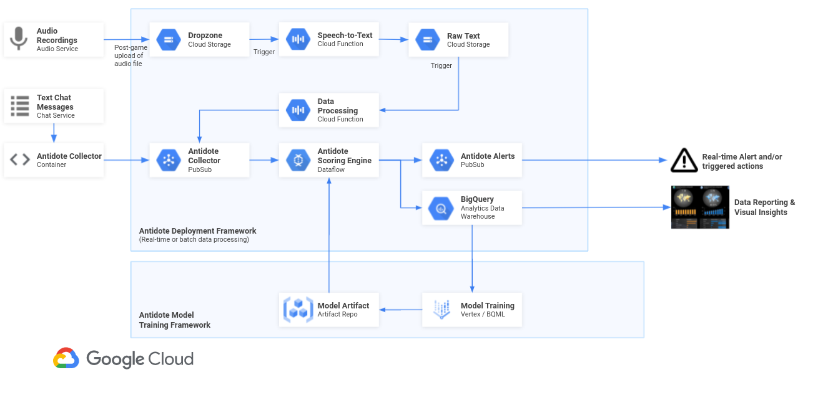

[![Contributors][contributors-shield]][contributors-url]
[![Forks][forks-shield]][forks-url]
[![Stargazers][stars-shield]][stars-url]
[![Issues][issues-shield]][issues-url]
[![MIT License][license-shield]][license-url]


<!-- PROJECT LOGO -->
<br />
<p align="center">
  <a href="https://github.com/googleforgames/antidote">
    
  </a>

  <h3 align="center">Antidote</h3>

  <p align="center">
     OSS framework for orchestrating the detection of disruptive behavior in video games
  
  </p>
</p>


<!-- TABLE OF CONTENTS -->
<details open="open">
  <summary><h2 style="display: inline-block">Table of Contents</h2></summary>
  <ol>
    <li>
      <a href="#project-overview">Project Overview</a>
      <ul>
        <li><a href="#reference-architecture">Reference Architecture</a></li>
      </ul>
    </li>
    <li>
      <a href="#getting-started">Getting Started</a>
      <ul>
        <li><a href="#prerequisites">Prerequisites</a></li>
        <li><a href="#installation">Installation</a></li>
      </ul>
    </li>
    <li><a href="#usage">Usage</a></li>
    <li><a href="#roadmap">Roadmap</a></li>
    <li><a href="#contributing">Contributing</a></li>
    <li><a href="#license">License</a></li>
    <li><a href="#contact">Contact</a></li>
    <li><a href="#references">References</a></li>
  </ol>
</details>


<!-- PROJECT OVERVIEW -->
## Project Overview

Antidote is an anti-toxicity, anti-cheat solution that makes games more enjoyable and inclusive for all.

Toxic behavior, content and players exist in all games, therefore it’s very important to regulate toxicity in the gaming industry to maintain the quality game experience that players will want to stay in.

Toxic behavior is becoming a large problem for online communities. Existing solutions are failing to stay relevant and stay fair.

Antidote is a globally scalable solution to detect and flag toxic or disruptive behavior. 

This gaming solution offers a configurable framework for analyzing chat/text messages, audio, and telemtry data.


These components make up the solution architecture:

**1. Collectors**

The collectors are modular comments used to integrate with 3rd party services such as 3rd party chat or voice services. The focus is to build up a pluggable repo of modules that connect to various services as well as general modules that listen for UDP or TCP traffic (as an example). Collectors will be build and open sourced based on demand.

**2. Scoring Engine**

The objective of the Scoring Engine is to analyze, score, and flag toxic or disruptive behavior. It is based on a serverless design pattern, so that it scales to meet varying data traffic patterns. The Scoring Engine is a hydrid model based on a swappable ML model plus heuristic rules to bias or set business specific thresholds.

**3. Ensemble**

The ensemble contains the core logic and algorithms to parse, process, and mathematically combine scores from the scoring engine. These scores may be related to toxicity, griefing, cheat, etc. 

**4. Cloud Functions**

Cloud Functions are used as part of this architecture to trigger serverless functions used as part of the pipeline. They may be used for parsing data, performing quality checks, pass data through an API (such as the Speech-to-text API), or a variety of other tasks. 

#### Reference Architecture



<!-- GETTING STARTED -->
## Getting Started

To get a local copy up and running follow these simple steps.

### Prerequisites


### Installation

1.  Edit the [config](config) file based on your GCP project, your naming convensions, and desired parameters. By editing the config file, you are able to refine how sensitive the scoring is, the duration of windowing (which is used to aggregate scores), and a variety of other GCP specific settings. Please see the [config](config) file for all parameter options as well as their associated descriptions. 

2.  Go to the setup folder

```
cd setup
```

3.  Run [01-setup.sh](setup/01-setup.sh) to spin up all GCP services needed for the solution. 

```
./01-setup.sh
```

4.  Deploy the Scoring Engine (the scoring engine runs on Google Cloud Dataflow)

```
./02-deploy-scoring-engine.sh
```

5.  Run the demo. There are two options here. You can (1) run a chat/text message demo that processes text entered by a user or (2) run an audio demo that analyzes a user audio file that is dropped in a Cloud Storage bucket. 

```
# Run the Chat/Text Message Demo
./10-demo-chat.sh
```

```
# Run the Audio Demo
./10-demo-audio-stt.sh
```


<!-- USAGE EXAMPLES -->
## Usage


<!-- ROADMAP -->
## Roadmap

See the [open issues](https://github.com/github_username/repo_name/issues) for a list of proposed features (and known issues).


<!-- CONTRIBUTING -->
## Contributing


1. Fork the Project
2. Create your Feature Branch (`git checkout -b feature/AmazingFeature`)
3. Commit your Changes (`git commit -m 'Add some AmazingFeature'`)
4. Push to the Branch (`git push origin feature/AmazingFeature`)
5. Open a Pull Request


<!-- LICENSE -->
## License

Distributed under the Apache 2.0 License. See `LICENSE` for more information.


<!-- CONTACT -->
## Contact

Project Link: [https://github.com/googleforgames/antidote](https://github.com/googleforgames/antidote)


<!-- REFERENCES -->
## References

* [Jigsaw Perspective API](https://www.perspectiveapi.com/)
* [Nice set of Cyber Bullying Datasets](https://data.mendeley.com/datasets/jf4pzyvnpj/1#__sid=js0)


<!-- MARKDOWN LINKS & IMAGES -->
<!-- https://www.markdownguide.org/basic-syntax/#reference-style-links -->
[contributors-shield]: https://img.shields.io/github/contributors/googleforgames/repo.svg?style=for-the-badge
[contributors-url]: https://github.com/googleforgames/antidote/graphs/contributors
[forks-shield]: https://img.shields.io/github/forks/googleforgames/repo.svg?style=for-the-badge
[forks-url]: https://github.com/googleforgames/antidote/network/members
[stars-shield]: https://img.shields.io/github/stars/googleforgames/repo.svg?style=for-the-badge
[stars-url]: https://github.com/googleforgames/antidote/stargazers
[issues-shield]: https://img.shields.io/github/issues/googleforgames/repo.svg?style=for-the-badge
[issues-url]: https://github.com/googleforgames/antidote/issues
[license-shield]: https://img.shields.io/github/license/googleforgames/repo.svg?style=for-the-badge
[license-url]: https://github.com/googleforgames/antidote/blob/master/LICENSE.txt
