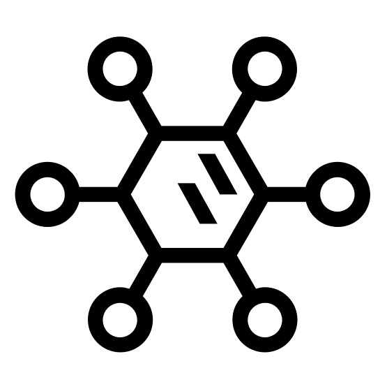

[![Contributors][contributors-shield]][contributors-url]
[![Forks][forks-shield]][forks-url]
[![Stargazers][stars-shield]][stars-url]
[![Issues][issues-shield]][issues-url]
[![MIT License][license-shield]][license-url]


<!-- PROJECT LOGO -->
<br />
<p align="center">
  

  <h3 align="center">Antidote</h3>

  <p align="center">
     OSS framework for orchestrating the detection of disruptive behavior in video games
  </p>
</p>


<!-- TABLE OF CONTENTS -->
<details open="open">
  <summary><h2 style="display: inline-block">Table of Contents</h2></summary>
  <ol>
    <li>
      <a href="#project-overview">Project Overview</a>
      <ul>
        <li><a href="#reference-architecture">Reference Architecture</a></li>
      </ul>
    </li>
    <li>
      <a href="#getting-started">Getting Started</a>
      <ul>
        <li><a href="#prerequisites">Prerequisites</a></li>
        <li><a href="#installation">Installation</a></li>
      </ul>
    </li>
    <li><a href="#usage">Usage</a></li>
    <li><a href="#roadmap">Roadmap</a></li>
    <li><a href="#contributing">Contributing</a></li>
    <li><a href="#license">License</a></li>
    <li><a href="#contact">Contact</a></li>
    <li><a href="#references">References</a></li>
  </ol>
</details>


<!-- PROJECT OVERVIEW -->
## Project Overview

Antidote is an anti-toxicity, anti-cheat solution that makes games more enjoyable and inclusive for all.

Toxic behavior, content, and players exist in all games. Therefore it’s very important to regulate toxicity in the gaming industry to maintain the quality game experience that players will want to stay in.

Toxic behavior is becoming a large problem for online communities. Existing solutions are failing to stay relevant and stay fair.

Antidote is a globally scalable solution to detect and flag toxic or disruptive behavior. 

This gaming solution offers a configurable framework for analyzing chat/text messages and audio.


These components make up the solution architecture:

**1. Collectors**

Collectors are modular components that are used to capture and route data, such as text, audio, or gameplay data, from 3rd party services into the Antidote framework. The objective is to build up a pluggable repo of modules that connect to various services as well as generalized collectors that listen for standard UDP or TCP traffic (as an example). Collectors will be built and open sourced based on demand.

**2. API Endpoints**

Antidote contains an an API Endpoint, that works with ESPv2 for OpenAPI. These API Endpoints allow chats and audio files to be passed into the Antidote framework through a secure, monitored service. The component is based on [Google Cloud Endpoints with ESPv2](https://cloud.google.com/endpoints/docs/openapi/tutorials).

**3. Scoring Engine**

The Scoring Engine is based on Apache Beam, which enables an open source, unified model for defining both batch and streaming data processing pipelines. The objective of the Scoring Engine is to analyze, score, and flag toxic or disruptive behavior. It is based on a serverless design pattern, which allows the service to scale to meet varying data traffic patterns and demand. A unique feature of this deployment, is The Scoring Engine is a hydrid model based on a swappable ML model plus heuristic rules to bias or set business specific thresholds. [Google Cloud Dataflow](https://cloud.google.com/dataflow/docs/concepts), which is a managed service for Apache Beam, is used to deploy and scale the Scoring Engine.


**4. Cloud Functions**

Cloud Functions are used as part of this architecture to trigger serverless functions used as part of the event-driven pipeline. These functions are used for parsing data, performing quality checks, calling ML-based APIs (such as the Speech-to-text API), or a variety of other tasks. 

**5. ML Model Pipeline**

The pipeline module orchestrates training and orchestration of the toxicity model. 

#### Reference Architecture


<!-- GETTING STARTED -->
## Getting Started

Follow these steps to config and lauch the Antidote framework:

### Installation

1.  **Edit the [config](config)** file based on your GCP project, your naming convensions, and desired parameters. By editing the config file, you are able to refine how sensitive the scoring is, the duration of windowing (which is used to aggregate scores), and a variety of other GCP specific settings. Please see the [config](config) file for all parameter options as well as their associated descriptions. 

```
vi config
```

2.  **Initialize GCP Services**. This command will enable GCP APIs, create Cloud Storage buckets, create PubSub topics, Create BigQuery Datasets and Tables, etc. 

```
make initialize-gcp
```

3.  **Deploy Cloud Functions**

```
make deploy-cloud-functions
```

4.  **Deploy the Endpoint Backend** (deployed on Cloud Run)

```
make deploy-endpoint-backend
```

5.  **Deploy the Scoring Engine** (the scoring engine runs on Google Cloud Dataflow)

```
make deploy-scoring-engine
```


### Run the Demo

There are currently two ways to score toxicity, both which can be demoed. The demos include: 

1) Run a chat/text message client that allows a user to enter text and each text message will be scored for toxic language.  that processes text entered by a user and scores each message. In production, a chat client can be launched in order to forward all chat messages into GCP (via PubSub).

2) Run an audio file demo that analyzes a user audio file that is dropped in a Cloud Storage bucket. In production, files can be programically uploaded into the specified Cloud Storage bucket when a match ends or at a scheduled time for batch scoring.

```
# Option #1
# Run the Chat/Text Message Demo
cd ./setup 
./10-demo-chat.sh
```

```
# Option #2
# Run the Audio Demo
cd ./setup
./10-demo-audio-stt.sh
```
## Machine Learning Pipeline

This module presents a packaged TFX pipeline for training and deploying your own custom toxicity model. Antidote currently utilizes the [TF Hub BERT Model](https://tfhub.dev/) as it's base language model. 

The architecture consists of: 
- The model pipeline (tfx_pipeline.py). A TFX/Kubeflow pipeline to transform the training data, train the model, and push the resulting model artifact 
  - transform.py (TFX transform file)
  - trainer.py (TFX training file)
- The pipeline runner (kubeflow_dag_runner.py)

You will need to setup a kubernetes cluster with kubeflow deployed on it. This is where your built pipeline will reside. 

You can set up your cluster with [AI Platform Pipelines](https://cloud.google.com/ai-platform/pipelines/docs/getting-started) manually, or automatically build the cluster with: 
```
create-pipeline-cluster
```

Be sure to set the name of your endpoint

```
export ENDPOINT="Your Endpoint Name"
```
You can build your pipeline by running 

```
make tfx-create-pipeline
```

Additional runs of the pipeline can be conducted with: 

``` 
make tfx-run
```

### Setting Up Model Serving (In Progress)

To deploy your pipeline to the cloud, we need both a serving container and a serving cluster. You can create both with:  

```
make build-model-serving
create-serving-cluster: 
```
You can then deploy your pipeline with: 
```
make deploy serving
```

<!-- ROADMAP -->
## Roadmap

Project is currently in alpha status, and is being actively developed. Expect things to break.

Not to be used in production systems.

See the [open issues](https://github.com/github_username/repo_name/issues) for a list of proposed features (and known issues).


<!-- CONTRIBUTING -->
## Contributing

Participation in this project comes under the Contributor Covenant Code of Conduct

Please read the contributing guide for directions on writing code and submitting Pull Requests.

Antidote is in active development - we would love your help in shaping its future!

<!-- LICENSE -->
## License

Distributed under the Apache 2.0 License. See `LICENSE` for more information.


<!-- REFERENCES -->
## References

* [Jigsaw Perspective API](https://www.perspectiveapi.com/)
* [Dataset - Kaggle Toxic Comment Classification Challenge](https://www.kaggle.com/c/jigsaw-toxic-comment-classification-challenge)
* [Dataset - Kaggle League of Legends Tribunal Chatlogs](https://www.kaggle.com/simshengxue/league-of-legends-tribunal-chatlogs)
* [Dataset - Cyber Bullying](https://data.mendeley.com/datasets/jf4pzyvnpj/1#__sid=js0)
* [GCP - Building a pipeline to profile audio content](https://cloud.google.com/architecture/building-a-pipeline-to-profile-audio-content#deploy_the_cloud_function_that_tests_for_appropriate_content)
* [GCP - Implementing production-ready live audio transcription using Speech-to-Text](https://cloud.google.com/architecture/architecture-for-production-ready-live-transcription-tutorial)

<!-- MARKDOWN LINKS & IMAGES -->
<!-- https://www.markdownguide.org/basic-syntax/#reference-style-links -->
[contributors-shield]: https://img.shields.io/github/contributors/googleforgames/repo.svg?style=for-the-badge
[contributors-url]: https://github.com/googleforgames/antidote/graphs/contributors
[forks-shield]: https://img.shields.io/github/forks/googleforgames/repo.svg?style=for-the-badge
[forks-url]: https://github.com/googleforgames/antidote/network/members
[stars-shield]: https://img.shields.io/github/stars/googleforgames/repo.svg?style=for-the-badge
[stars-url]: https://github.com/googleforgames/antidote/stargazers
[issues-shield]: https://img.shields.io/github/issues/googleforgames/repo.svg?style=for-the-badge
[issues-url]: https://github.com/googleforgames/antidote/issues
[license-shield]: https://img.shields.io/github/license/googleforgames/repo.svg?style=for-the-badge
[license-url]: https://github.com/googleforgames/antidote/blob/master/LICENSE.txt
