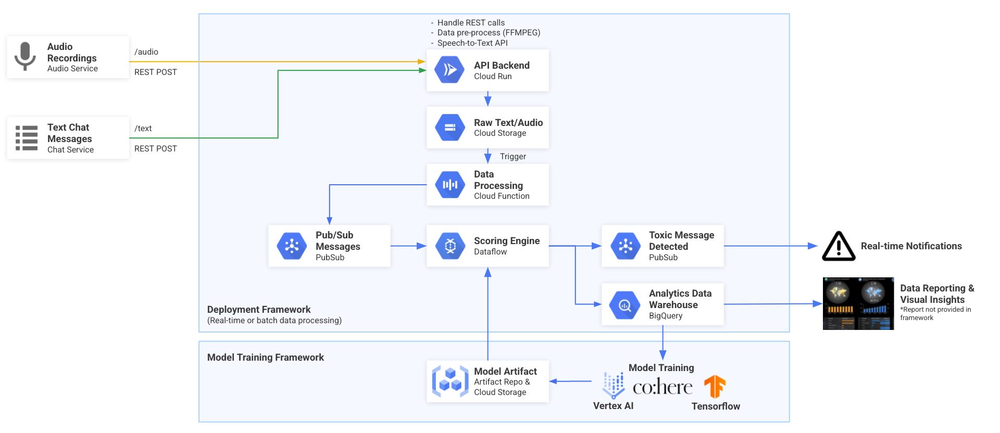

[](./LICENSE)
[](https://github.com/googleforgames/clean-chat)


<!-- PROJECT LOGO -->
<br />
<p align="center">
  

  <h3 align="center">Clean Chat</h3>

  <p align="center">
     OSS framework detecting disruptive behavior in games
  </p>
</p>


<!-- TABLE OF CONTENTS -->
<details open="open">
  <summary><h2 style="display: inline-block">Table of Contents</h2></summary>
  <ol>
    <li>
      <a href="#project-overview">Project Overview</a>
      <ul>
        <li><a href="#reference-architecture">Reference Architecture</a></li>
      </ul>
    </li>
    <li>
      <a href="#getting-started">Getting Started</a>
      <ul>
        <li><a href="#prerequisites">Prerequisites</a></li>
        <li><a href="#installation">Installation</a></li>
      </ul>
    </li>
    <li><a href="#usage">Usage</a></li>
    <li><a href="#roadmap">Roadmap</a></li>
    <li><a href="#contributing">Contributing</a></li>
    <li><a href="#license">License</a></li>
    <li><a href="#contact">Contact</a></li>
    <li><a href="#references">References</a></li>
  </ol>
</details>


<!-- PROJECT OVERVIEW -->
## Project Overview

Clean Chat is an open source solution to eliminate or mitigate toxic behavior in online multiplayer video games, with the goals of making games more enjoyable and inclusive for all. In large open multiplayer games, toxicity is rampant. Clean Chat provides the ability to proactively detect toxicity in voice and text chat, and provides scores to game moderation services or player support personnel. The project provides a globally scalable framework for training, deploying, and maintaining low-latency anti-toxicity models. . The framework comes pre-packaged with several machine learning 'base models' that allow you to train, or fine tune, the models to detect toxic speech in the vernacular of your game's players.


**What Clean Chat Is Not**

Clean Chat is not a specific model for detecting toxicity. It is a <i>framework</i> where users can train and deploy their own ML model or they can build upon our pre-trained base models. 

---

## Architecture Components:

Clean Chat’s design is divided into three main components: 
 - The Scoring Engine: This is the online service that hosts the toxicity detection models, and conducts aggregation of the results. 
- Game Telemetry Intake: Clean Chat’s means of communicating with Game Servers and handling game telemetry data from them. Note - Clean Chat is specifically designed to work as a third-party service or sidecar to the game server, and does not directly communicate with the client itself
- ML Model Pipeline: A self-contained, ML-Ops driven framework for training, deploying, and maintaining toxicity models. The Model pipeline provides several options for base models, including both open source and Google Cloud Partner Models. 

**1. API Backend Service**

Clean Chat contains an an API Backend service. This service accepts text chat and audio files to be passed into the framework. The backend service is deployed on [Google Cloud Run](https://cloud.google.com/run) and exposed as an internal service with a dedicated service account.

**2. Cloud Functions**

Cloud Functions are used as part of this architecture to trigger serverless functions used as part of the event-driven pipeline. These functions are used for parsing data, performing quality checks, calling ML-based APIs (such as the Speech-to-text API), or a variety of other tasks. 

**3. Scoring Engine**

The Scoring Engine is based on Apache Beam, which enables an open source, unified model for defining both batch and streaming data processing pipelines. The objective of the Scoring Engine is to analyze, score, and flag toxic or disruptive behavior. It is based on a serverless design pattern, which allows the service to scale to meet varying data traffic patterns and demand. A unique feature of this deployment, is The Scoring Engine is a hydrid model based on a swappable ML model plus heuristic rules to bias or set business specific thresholds. [Google Cloud Dataflow](https://cloud.google.com/dataflow/docs/concepts), which is a managed service for Apache Beam, is used to deploy and scale the Scoring Engine.

**4. ML Model Pipeline**

The pipeline module orchestrates training and orchestration of the toxicity model. 

---

## Reference Architecture


<!-- GETTING STARTED -->
## Getting Started

Follow these steps to config and deploy the Clean Chat framework:

1. Clone the repo

    ```
    git clone https://github.com/googleforgames/clean-chat
    ```

2. Make a copy of the [config.default](./config.default)

    ```
    cp config.default config
    ```

3. Edit the config file 

    This file should be updated to reflect your GCP project ID, your naming convensions, and desired parameters. By editing the config file, you are able to customize how sensitive the scoring is, the duration of windowing (which is used to aggregate scores), and a variety of other GCP specific settings.

    ```
    vi config
    ```

4.  Initialize Terraform for deployment 

    ```
    make terraform-init
    ```

5.  Deploy the GCP services, executing the actions proposed in a Terraform plan

    ```
    make terraform-apply
    ```

6.  Deploy the Scoring Engine (the scoring engine runs on Google Cloud Dataflow)

    ```
    make deploy-scoring-engine

    # NOTE: You can also deploy the scoring engine in interactive mode, for testing/debugging purposes using hte following commmand:
    make deploy-scoring-engine-interactive
    ```

7.  Deploy the API Backend Service

    ```
    make make deploy-backend-api
    ```

## Examples

As an example, and for testing purposes, here are a few sample scripts that can be called once the framework has been deployed:

```
# Option #1 
# Hello World example to ensure that the Backend API service is responding.
python3 ./examples/api-backend-get-test.py
```

```
# Option #2
# Run the Chat/Text Message example
python3 ./examples/api-backend-post-text.py
```

```
# Option #3
# Run the Audio Demo
python3 ./examples/api-backend-post-audio.py
```

## Toxicity Model Sidecar

Clean Chat comes pre-packaged with a framework to train, test, and deploy toxicity detection models. Currently, the framework supports models that detect toxicity in voice and text chat. Clean Chat provides two model training interfaces; one basic training interface that only utilizes the training features of Keras, and one that supports an ML Ops framework. 

## Model Choices

### Cohere.AI 
Cohere.ai is a Google Cloud Partner who provides a developer API to create high-quality word embeddings. Users may “fine tune” a base cohere embedding model to receive embeddings that are specific to a Game’s dataset. We then provide a base Keras feed-forward neural network model, similar to those provided in Google tutorials, for a user to adjust. The Cohere Embeddings are fed into the Keras model, and the model is trained. 

To learn more about Cohere, see their [documentation](https://docs.cohere.ai/).

To utilize the Cohere model, run: 

```
python .components/model/cohere/main.py 'API KEY HERE' 'DATA PATH HERE' 'COHERE MODEL TYPE HERE'
```

### BERT

BERT is a transformer language model developed by Google in 2018. BERT is available via Tensorflow Hub, and users can fine-tune the model to their Game’s dataset. 

#### Model Training with TFX (ML Ops)

This module presents a packaged TFX pipeline for training and deploying your own custom toxicity model. Clean Chat currently supports the [TF Hub BERT Model](https://tfhub.dev/) as it's base language model in a TFX framework. 

The architecture consists of: 
- The model pipeline (tfx_pipeline.py). A TFX/Kubeflow pipeline to transform the training data, train the model, and push the resulting model artifact 
  - transform.py (TFX transform file)
  - trainer.py (TFX training file)
- The pipeline runner (kubeflow_dag_runner.py)

You will need to setup a kubernetes cluster with kubeflow deployed on it. This is where your built pipeline will reside. You can set up your cluster with:

```
make create-pipeline-cluster
```
Your pipeline endpoint (the address of your pipeline is now contained in the enviroment variable KUBEFLOW_ENDPOINT

Before you build your pipeline, set the enviroment variables for the number of training steps, evaluation steps, adn the path to the model's training data. 

```
export TRAINING_DATA_PATH='path here'
export TRAINING_STEPS='training steps'
export EVAL_STEPS='eval steps'
```

To build your TFX pipeline on the Kubeflow cluster that you just created, run: 

```
make tfx-create-pipeline
```

Additional runs of the pipeline can be conducted with: 

``` 
make tfx-run
```

### Model Deployment

To deploy your pipeline to the cloud, we need both a serving container and a serving cluster. You can create the serving container with: 

``` 
make build-model-serving
```

Next, create a Kubernetes cluster to deploy your model on: 

``` 
make create-serving-cluster
```
Finally, to create a deployment of the model, run: 

```
make deploy-image
```
If you need to update the model that is currently being served, you may do so with: 

```
make serve-latest-model
```

<!-- ROADMAP -->
## Roadmap

Project is currently in alpha status, and is being actively developed. Expect things to break.

See the [open issues](https://github.com/googleforgames/clean-chat/issues) for a list of proposed features (and known issues).


<!-- CONTRIBUTING -->
## Contributing

Participation in this project comes under the Contributor Covenant Code of Conduct

Please read the contributing guide for directions on writing code and submitting Pull Requests.

Clean Chat is in active development - we would love your help in shaping its future!

<!-- LICENSE -->
## License

Distributed under the Apache 2.0 License. See `LICENSE` for more information.


<!-- REFERENCES -->
## References

* [Jigsaw Perspective API](https://www.perspectiveapi.com/)
* [Dataset - Kaggle Toxic Comment Classification Challenge](https://www.kaggle.com/c/jigsaw-toxic-comment-classification-challenge)
* [Dataset - Kaggle League of Legends Tribunal Chatlogs](https://www.kaggle.com/simshengxue/league-of-legends-tribunal-chatlogs)
* [Dataset - Cyber Bullying](https://data.mendeley.com/datasets/jf4pzyvnpj/1#__sid=js0)
* [GCP - Building a pipeline to profile audio content](https://cloud.google.com/architecture/building-a-pipeline-to-profile-audio-content#deploy_the_cloud_function_that_tests_for_appropriate_content)
* [GCP - Implementing production-ready live audio transcription using Speech-to-Text](https://cloud.google.com/architecture/architecture-for-production-ready-live-transcription-tutorial)

<!-- MARKDOWN LINKS & IMAGES -->
<!-- https://www.markdownguide.org/basic-syntax/#reference-style-links -->
[contributors-shield]: https://img.shields.io/github/contributors/googleforgames/repo.svg?style=for-the-badge
[contributors-url]: https://github.com/googleforgames/clean-chat/graphs/contributors
[forks-shield]: https://img.shields.io/github/forks/googleforgames/repo.svg?style=for-the-badge
[forks-url]: https://github.com/googleforgames/clean-chat/network/members
[stars-shield]: https://img.shields.io/github/stars/googleforgames/repo.svg?style=for-the-badge
[stars-url]: https://github.com/googleforgames/clean-chat/stargazers
[issues-shield]: https://img.shields.io/github/issues/googleforgames/repo.svg?style=for-the-badge
[issues-url]: https://github.com/googleforgames/clean-chat/issues
[license-shield]: https://img.shields.io/github/license/googleforgames/repo.svg?style=for-the-badge
[license-url]: https://github.com/googleforgames/clean-chat/blob/master/LICENSE.txt
